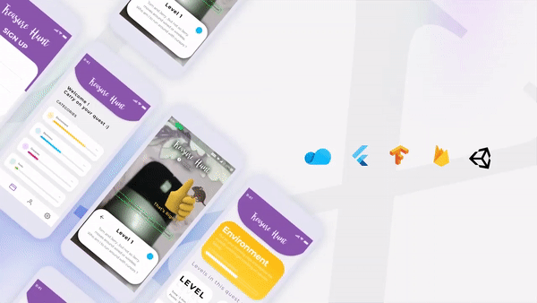

# Treasure Hunt - An ML/AR based game for kids  |  HTNE Project
A flutter based educational treasure hunt game for kids that uses ML to enforce the players to detect objets from their real life surroundings based on the provided riddles. [Watch a demo for the app here.](https://youtu.be/WS25rjKLdLg)

# Inspiration
This is inspired by technologies like AI, AR and the interactive gaming experiences they provide. This was an experimental project to try out the integration of AR, ML and image detection into the process of building a mobile application.

# What it does
We have developed this project as a way to make quarantine time more worthwile for ourselves (lol) , the people and to help engage people with things around them. It is an educational quest for kids through solve through levels of fun riddles that contain information and are representative of the common things around them in categories such as environment, animals, electronics, etc.

# How we built it
The Android application is built using **Flutter**. For the login, storage of leaderboard, etc we have used the **Firebase** database. Image detection and its training has been implemented using **TensorFlow Lite**. The Augmented Reality factor is achieved using **EchoAR** and rendered in **Unity**.

# Challenges we ran into
We were beginners in mobile development and particularly new to technology such as ML and AR. In our quest to find the best technology stack for the project, we were introduced to novel software such as EchoAR, in which we did not possess any prior experience. We stumbled at several stages of production and hence **the application has still not been developed completely to its potential.**

# Accomplishments that we're proud of
We have achieved success in training and building our ML model that accurately predicts the required result. We have also prototyped and developed the app to an extend and has applied an augmented reality reward notifier in the levels of the game.

# What we learned
We have gained a thorough understanding of the working and application of AR, image processing as well as mobile app development with Flutter. We are now comfortable in debugging and deploying application built with these.

# What's next for Treasure Hunt
We wish to expand the application in the future by allowing users to create their own quests or even questions to the existing categories. We aim to be capable of affluently training models based on the objects that are required to be detected by the users. To expand on a global state as such would bring in the right amount of educational push and an adrenaline rush we aspire to produce from our applications.

## Built With

* [**echoAR**](https://www.echoar.xyz/)
* [**Google Firebase**](https://firebase.google.com/)
* [**Flutter**](https://flutter.dev/)
* [**TensorFlow**](https://www.tensorflow.org/)
* [**Unity**](https://unity.com/)
